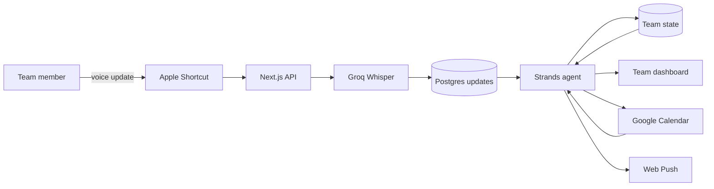
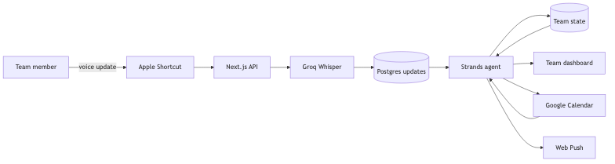

# Aven

Aven is a voice native operational memory for small teams. Teammates speak updates as work happens. Aven transcribes them, reconciles them with the current team state, and surfaces progress, blockers, decisions, commitments, deadlines, and conflicts.

Built for the Agents for Humans hackathon, Professional Agents track.

## How it works



The diagram source is in [`docs/architecture.mmd`](docs/architecture.mmd).



## Local setup

Requirements: Node.js 20 or newer, npm, PostgreSQL, and Python as required by the Strands service.

1. Install dependencies with `npm install`.
2. Run [`db/schema.sql`](db/schema.sql) against PostgreSQL.
3. Create `.env.local` with the variables below.
4. Start the app with `npm run dev -- -p 3699`.
5. Open `http://localhost:3699`.

```dotenv
DATABASE_URL=postgresql://...
GROQ_API_KEY=...
VOICE_INBOX_TOKEN=use-a-long-random-value
APP_URL=http://localhost:3699
INTEGRATION_ENCRYPTION_KEY=base64-encoded-32-byte-key
GOOGLE_CLIENT_ID=...
GOOGLE_CLIENT_SECRET=...
NEXT_PUBLIC_VAPID_PUBLIC_KEY=...
VAPID_PRIVATE_KEY=...
VAPID_SUBJECT=mailto:your-email@example.com
```

Generate the encryption key with `openssl rand -base64 32`. Generate the VAPID pair after installing dependencies with `npx web-push generate-vapid-keys`.

## Google Calendar setup

1. Create or select a project in Google Cloud Console.
2. Enable Google Calendar API.
3. Configure the OAuth consent screen. Add each demo account as a test user while the application is in testing mode.
4. Create an OAuth 2.0 Client ID with application type Web application.
5. Add `http://localhost:3699/api/integrations/google/callback` as a local authorized redirect URI.
6. Add `https://YOUR_DOMAIN/api/integrations/google/callback` as the production authorized redirect URI.
7. Set `GOOGLE_CLIENT_ID`, `GOOGLE_CLIENT_SECRET`, `APP_URL`, and `INTEGRATION_ENCRYPTION_KEY` in the deployment environment.
8. Visit `/api/integrations/google/connect` to authorize the calendar.

The integration stores OAuth tokens in an encrypted, secure, HTTP only cookie. This suits the single browser hackathon demo. A multiuser deployment should store encrypted tokens by team and user in the database.

`GET /api/integrations/google/calendar` lists primary calendar events for the next seven days. Optional `timeMin` and `timeMax` query parameters accept ISO timestamps. `POST /api/integrations/google/calendar` creates an event from `summary`, `start`, optional `end`, and optional `description`. `POST /api/integrations/google/disconnect` clears the connection.

## Browser notifications

The app exposes a web app manifest and service worker at `/sw.js`. The browser must register the worker, request notification permission from a user gesture, and call `pushManager.subscribe` with `NEXT_PUBLIC_VAPID_PUBLIC_KEY`. Store the returned subscription with the team member record when persistent subscription storage is connected.

`POST /api/integrations/push/send` sends a notification to a supplied Web Push subscription. It requires `Authorization: Bearer <VOICE_INBOX_TOKEN>` and this JSON shape:

```json
{
  "subscription": {
    "endpoint": "https://push-service.example/...",
    "keys": { "p256dh": "...", "auth": "..." }
  },
  "notification": {
    "title": "Decision needed",
    "body": "Deployment is waiting for migration review.",
    "url": "/",
    "tag": "migration-review"
  }
}
```

Production Web Push requires HTTPS. Localhost is treated as a secure context by current browsers.

## Voice capture

Create an Apple Shortcut with Record Audio followed by Get Contents of URL. Send a `POST` request to `https://YOUR_DOMAIN/api/notes`, set `Authorization` to `Bearer YOUR_VOICE_INBOX_TOKEN`, choose a form request body, and attach Recorded Audio in the `audio` file field.

Audio remains in request memory, goes directly to Groq for transcription, and is never written to disk or object storage.

## API

All voice inbox and push send requests use `Authorization: Bearer <VOICE_INBOX_TOKEN>`.

* `POST /api/notes`: accept raw audio or multipart audio up to 25 MB.
* `GET /api/notes`: return pending transcripts oldest first.
* `POST /api/notes/:id/ack`: acknowledge a transcript.
* `GET /api/integrations/google/connect`: start Google OAuth.
* `GET /api/integrations/google/callback`: complete Google OAuth.
* `GET, POST /api/integrations/google/calendar`: read or create calendar events.
* `POST /api/integrations/google/disconnect`: clear Google authorization.
* `POST /api/integrations/push/send`: deliver a Web Push notification.

## Deployment

Deploy the Next.js app to Vercel or another Node.js host. Provision PostgreSQL, run the schema, configure every environment variable listed above, and update `APP_URL` plus the Google production redirect URI. Keep all private keys and OAuth secrets server side.

The final submission checklist and suggested demo path are in [`docs/SUBMISSION.md`](docs/SUBMISSION.md).

## License

MIT. See [`LICENSE`](LICENSE).
